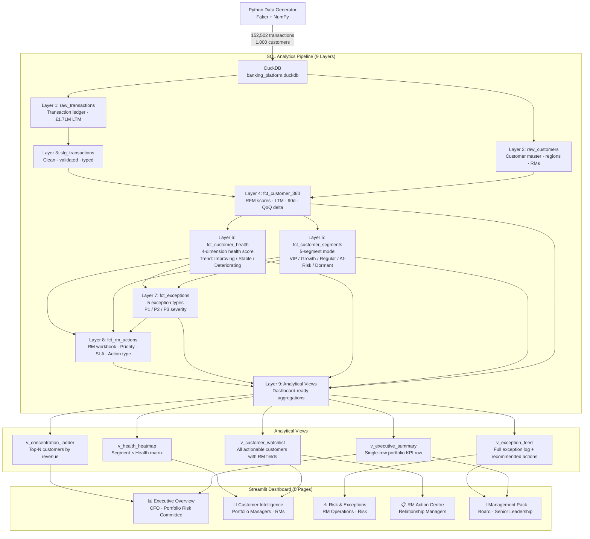

# Architecture: Banking Customer Intelligence & Risk Analytics Pipeline

## Overview

A 9-layer incremental SQL analytics pipeline built on DuckDB, with a 5-page Streamlit executive dashboard. The pipeline transforms 152,502 raw transactions and 1,000 customer records into portfolio KPIs, risk exceptions, RM action workbooks, and management pack reports.

---

## Data Flow Diagram



---

## Layer-by-Layer Detail

### Layer 1-2: Raw Data
- **raw_transactions**: 152,502 transactions with customer_id, transaction_date, amount, transaction_type, product_category. Date range: Feb 2023 – Jan 2024.
- **raw_customers**: 1,000 customers with region, assigned RM, industry, company_size.

### Layer 3: Staging
- **stg_transactions**: Type-casted, validated, date-normalised version of raw transactions. Null amounts zeroed. Basis for all downstream aggregation.

### Layer 4: Customer 360 (`fct_customer_360`)
- Aggregates per customer: LTM revenue, 90-day revenue, prior 90-day revenue, QoQ delta %, transaction counts, active product count, average transaction size, days since last transaction.
- RFM scoring: Recency (days_since_last_txn), Frequency (txn_count_90d), Monetary (revenue_ltm) each scored 1–5.

### Layer 5: Segmentation (`fct_customer_segments`)
Deterministic 5-segment model based on RFM composite score:
| Segment | Criteria |
|---|---|
| VIP | RFM ≥ 12 or revenue_ltm in top decile |
| Growth | RFM 9–11, revenue improving QoQ |
| Regular | RFM 6–8, stable revenue |
| At-Risk | RFM 3–5 or revenue declining >20% |
| Dormant | No transactions in 90+ days |

### Layer 6: Health Scoring (`fct_customer_health`)
4-dimension composite health score (0–100):
| Dimension | Weight | Inputs |
|---|---|---|
| Revenue Trend | 35% | QoQ delta, 90d vs prior |
| Engagement | 25% | Transaction frequency, recency |
| Relationship Breadth | 20% | Active products, txn diversity |
| Portfolio Momentum | 20% | Segment stability, trend direction |

Health categories: Healthy ≥70 · Watchlist 45–69 · At-Risk 25–44 · Critical <25

### Layer 7: Exceptions (`fct_exceptions`)
5 automated exception types with P1/P2/P3 severity:
| Exception Type | Trigger | Severity |
|---|---|---|
| VIP Revenue Decline | VIP client, QoQ decline >20% | P1 |
| Segment Downgrade | Customer moved to lower segment | P2 |
| Critical Health Score | Health score <25 | P2 |
| Activity Cliff | Transaction count dropped >50% | P3 |
| Revenue Decline | Any customer QoQ decline >15% | P3 |

### Layer 8: RM Actions (`fct_rm_actions`)
One action per customer, assigned priority and SLA:
| Action | Trigger | Priority | SLA |
|---|---|---|---|
| Retain | At-Risk or critical health + revenue decline | P1/P2 | 24h / 3d |
| Review | Healthy but deteriorating trend | P2/P3 | 3–7d |
| Reactivate | Dormant account | P3 | 7d |
| Cross-Sell | Healthy, growing, low product count | P3 | 7d |
| Monitor | Stable, no intervention needed | P4 | 30d |

### Layer 9: Analytical Views
Pre-computed, join-heavy views optimised for dashboard read patterns. All dashboard queries hit only these views — no ad-hoc joins at runtime.

---

## Dashboard Architecture

```
streamlit run dashboard/app.py
        │
        ├── app.py                     st.navigation() router
        │       ├── inject_css()       Global CSS applied on every page load
        │       └── sidebar branding   Persistent across all pages
        │
        ├── utils/
        │   ├── db.py                  @st.cache_data(ttl=3600) query layer
        │   │       └── duckdb.connect(read_only=True)
        │   ├── styles.py              C{} color dict · kpi_card() · page_header()
        │   └── charts.py             donut() · health_heatmap() · top_customers_bar()
        │
        └── pages/
            ├── executive_overview.py  KPIs · 3 donuts · top-10 bar · P1 cards
            ├── customer_intelligence.py  Heatmap · scatter · filtered table
            ├── risk_exceptions.py     P1 banner · exception bar · severity donut
            ├── rm_action_centre.py    Action breakdown · RM workbook table
            └── management_pack.py    Monthly business review · Key findings
```

**Caching strategy**: All DuckDB queries are cached with `@st.cache_data(ttl=3600)`. The cache key is the SQL string, so identical queries across pages hit the cache. Dashboard opens the database in `read_only=True` mode — no write lock conflicts with the pipeline.

---

## Design Decisions

**DuckDB over PostgreSQL**: In-process analytical engine eliminates infrastructure setup. The entire database is a single `.duckdb` file — trivially shareable and portable. DuckDB's columnar execution outperforms row-based engines for the aggregation patterns this pipeline uses.

**9-layer incremental model**: Each layer depends only on the layer below it, mimicking dbt's incremental materialisation pattern. Any layer can be rebuilt independently. This makes the pipeline auditable — you can inspect every intermediate table.

**One action per customer**: `fct_rm_actions` uses `ROW_NUMBER() OVER (PARTITION BY customer_id ORDER BY priority)` to ensure each customer has exactly one action. This prevents RM workbook duplication and makes the count metrics unambiguous.

**Views as the dashboard contract**: The dashboard accesses only views, never base tables. This decouples the dashboard from the underlying schema — any refactoring of layers 1–8 is invisible to the dashboard as long as the view interface is preserved.

**Hardcoded fallback values**: KPI variables in dashboard pages have hardcoded defaults (e.g. `kpis.get("portfolio_revenue_ltm", 1_711_764)`). These match the actual pipeline output, so the dashboard renders correctly even if the view column name changes — the worst case is stale fallback data, not a crash.
